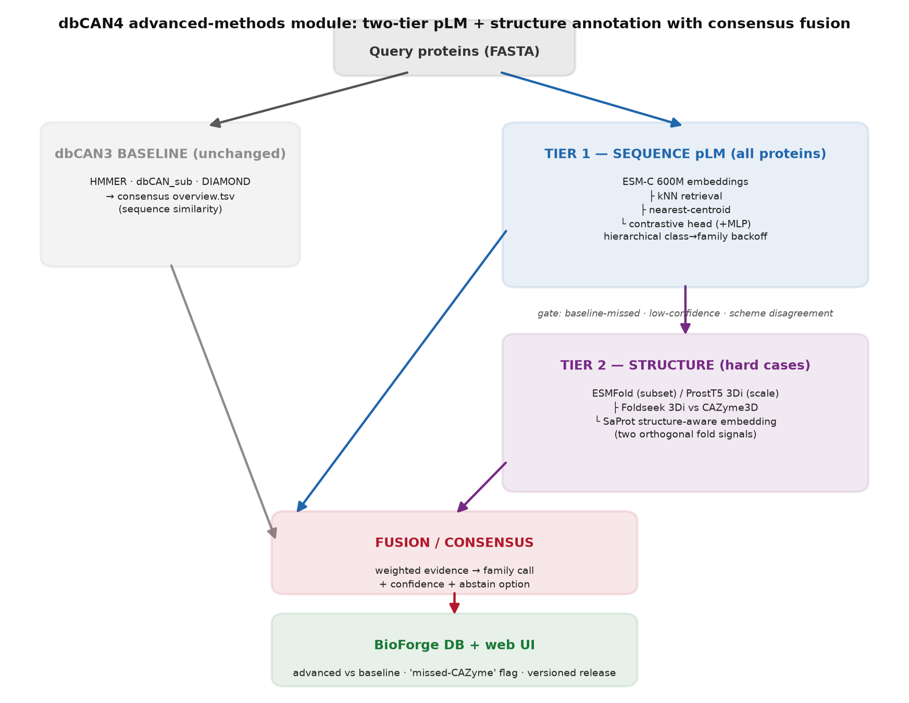

# dbCAN4-advanced

**Protein-language-model + structure-similarity CAZyme annotation, beyond HMMER/DIAMOND.**

Current dbCAN (dbCAN3 / `run_dbcan`) assigns CAZy families by sequence similarity
(HMMER, dbCAN_sub, DIAMOND). This misses **remote-homolog CAZymes** — enzymes that
share fold, mechanism, and active-site geometry with known families but have drifted
below the sequence-identity detection threshold. This repository develops dbCAN's own
**advanced-methods module** to recover them, benchmarks it against the dbCAN baseline,
and prepares the winning components for a future **dbCAN4**.

Reference movers in the field: **CAZyLingua** (pLM-only) and **DEFT** (pLM + structure).
We build our own, using **ESM-C** embeddings, **Foldseek** structure search against our
group's **CAZyme3D** database, a **CLEAN**-style contrastive head, and a consensus fusion.

## Architecture



A two-tier design — a fast sequence-only tier (ESM-C embeddings → retrieval /
contrastive / classifier) that runs on every protein, and a structure tier
(ESMFold/ProstT5 → Foldseek vs CAZyme3D + SaProt embeddings) reserved for hard cases —
feeding a fusion layer that produces one calibrated family call with an abstain option.

Full design rationale, method survey, and references: **[docs/design_dbcan4_advanced.md](docs/design_dbcan4_advanced.md)**.

## Repository layout

```
docs/         design document, architecture diagram, generated figures
src/          the dbcan4_advanced package (embedding, retrieval, structure, fusion)
scripts/      runnable pipeline entry points (embed, baseline, foldseek, fuse, benchmark)
benchmarks/   benchmark tables, metrics, and the final benchmark report
notebooks/    exploratory analysis
```

## Evaluation design

- **Primary — temporal holdout (2024 → 2025):** train/reference on the 2024 CAZy release,
  test on 2025. The 2025-only entries are genuinely new content; recovering them (especially
  entries the 2024-era HMMER/DIAMOND profiles miss) is direct evidence the advanced methods
  find *novel* CAZymes. Split into novel-sequence (family exists in 2024) and novel-family
  (out-of-training → correct behavior is class-level backoff / abstain).
- **Secondary — identity-controlled split** (≤30 % identity): the classic remote-homolog stress test.
- **Fungal proteome set** for the application domain and the "HMMER/DIAMOND-missed" subset.

## Status

One-week prototype sprint. Progress is logged daily in **[docs/daily-log.md](docs/daily-log.md)**.

## Compute

Primary host `met.unl.edu` (128 CPU, 8× RTX A5500 24 GB, 386 GB RAM). Environment setup
is recorded in `docs/env_setup.md` once ported.

## License

MIT — see [LICENSE](LICENSE).
