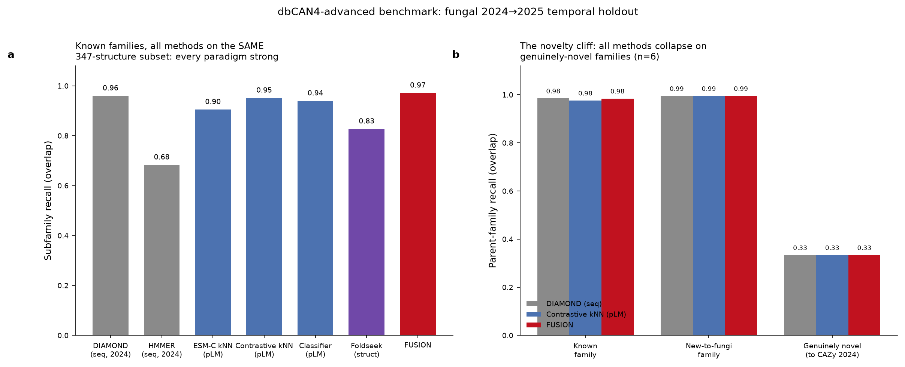
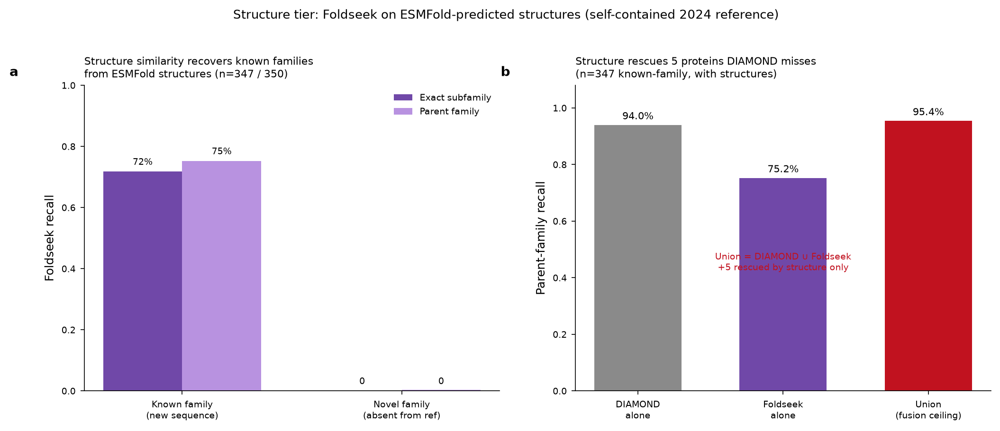
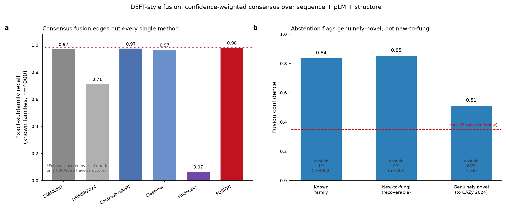
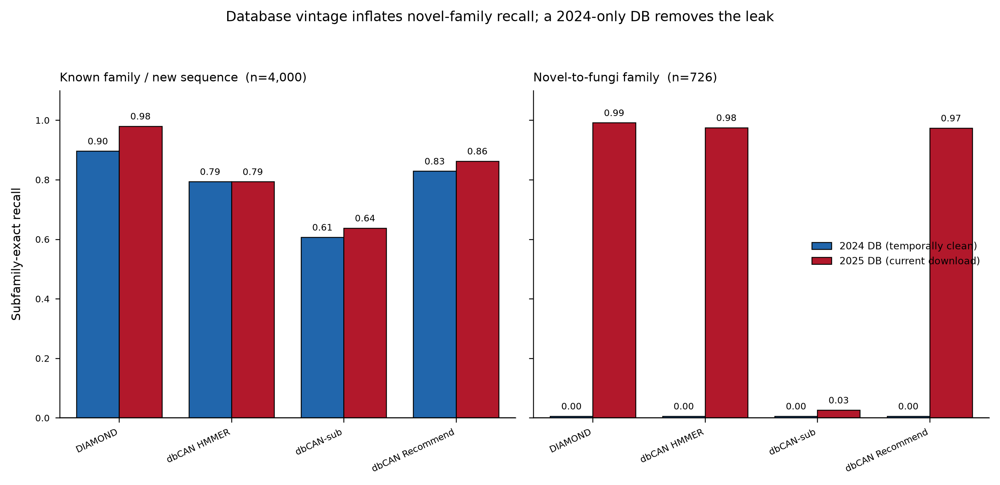
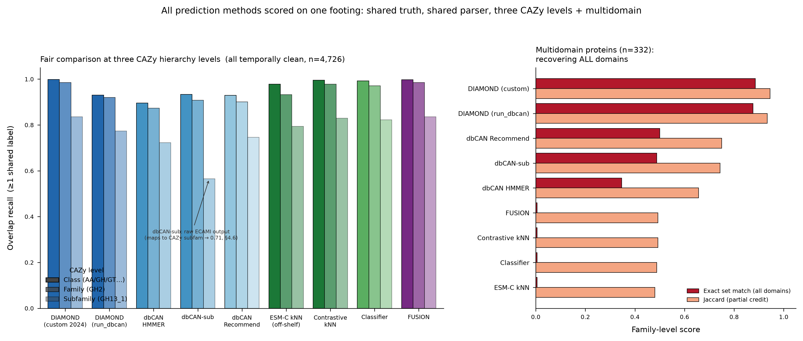

# dbCAN4-advanced: Benchmark Report

**Advanced CAZyme annotation for fungi — protein language models + structure similarity beyond HMMER/DIAMOND**

*dbCAN development team · fungal 2024→2025 temporal holdout · compute on `met` (8× RTX A5500)*

---

## 1. Motivation

dbCAN's production annotation rests on sequence similarity: HMMER against family
profile HMMs (`dbCAN.hmm`, `dbCAN-sub.hmm`) and DIAMOND against the CAZy sequence
database. Sequence similarity is fast and accurate when a query has a homolog in
the reference, but it has a structural blind spot: a CAZyme whose fold is
conserved but whose sequence has diverged below the detection threshold is
missed. The field is adding two complementary signals — **protein language model
(pLM) embeddings** (CAZyLingua) and **structure similarity** (DEFT, Foldseek vs
CAZyme3D). This project builds dbCAN's own implementation of both, targeting a
future dbCAN4, and benchmarks them honestly against the sequence baselines.

The prediction target is the **CAZy family** (GH/GT/PL/CE/AA/CBM + number), scored
at two granularities: **exact subfamily** (e.g. GH5_40) and **parent family**
(GH5).

## 2. Evaluation design — temporal holdout

We use the lab's own fungal CAZyme sets: **2024** (`CAZyDB.07142024`) as the
knowledge base and **2025** (`CAZyDB.07242025`) as the test, so the benchmark
measures what a 2024-era annotator would find in 2025 data — the real deployment
question. From these we built:

- **Reference (2024):** 337,759 labeled fungal CAZymes, 411 subfamily labels /
  266 base families.
- **Evaluation (2025), 4,726 held-out proteins** in three novelty tiers, defined
  by exact-sequence identity against 2024:
  - **known family / new sequence** (`novel_seq`, n=4,000): family seen in 2024,
    sequence not.
  - **novel family** (`novel_family`, n=726): family label absent from the 2024
    *fungal* reference.

### 2.1 A correction that reshaped the novelty story

The initial `novel_family` tier was defined against the **fungal** 2024 subset.
On inspection (prompted during review), most of these families are **not new
CAZy families at all** — they exist in CAZy 2024 in *other kingdoms* (bacteria,
plants) and were simply newly annotated in fungi in 2025. Re-scoring all 726
`novel_family` sequences against the **full all-kingdom** 2024 CAZy:

- **95.9% (696/726)** have their parent family recoverable from all-kingdom 2024
  → **new-to-fungi, not new families**.
- Only **6 sequences** have no parent-family hit even against all of CAZy 2024
  → genuinely-novel-to-CAZy candidates (3× CBM104, 2× GH2_10, 1× GT109). Of the
  original 6 "truly-novel base families," five (CBM3, CBM8, GT109, GT119, PL29)
  had thousands-to-hundreds of 2024 headers in non-fungal kingdoms; only
  **CBM104** is genuinely absent from CAZy 2024.

**Consequence:** this fungal holdout is predominantly a **cross-kingdom-transfer
test**, and only weakly a novel-family-discovery test (~6 genuinely novel
sequences). The report treats these two questions separately.

## 3. Methods benchmarked

| Tier | Method | Reference / training | Confidence signal |
|---|---|---|---|
| Sequence | **dbCAN HMMER** (run_dbcan) | `dbCAN.hmm` — 2024 (fair) & 2025 (current) DB | HMM E-value |
| Sequence | **dbCAN-sub** (run_dbcan) | `dbCAN-sub.hmm` — 2024 & 2025 DB | HMM E-value |
| Sequence | **dbCAN Recommend** (run_dbcan) | run_dbcan consensus — 2024 & 2025 DB | tool agreement |
| Sequence | **DIAMOND** (run_dbcan) | CAZy `.dmnd` — 2024 (fair) & 2025 (current) DB | bit score |
| Sequence | **DIAMOND** (custom, temporal) | fungal 2024 reference | % identity |
| Sequence | **HMMER** (temporal) | 223 family HMMs built from 2024 | HMM E-value |
| pLM | **ESM-C kNN** (off-the-shelf) | ESM-C 600M embeddings, 2024 | vote purity |
| pLM | **Contrastive kNN** (trained) | SupCon head on ESM-C, 2024 | vote purity |
| pLM | **Classifier** (trained) | softmax head on ESM-C, 2024 | max-softmax |
| Structure | **Foldseek** | ESMFold structures vs 2024 ref | TM-score |
| Fusion | **DEFT-style consensus** | all of the above | weighted vote |

**pLM tier (ESM-C, per user preference over ESM-2).** Mean-pooled ESM-C 600M
embeddings (1152-dim). Retrieval by kNN (k=15) and nearest-centroid over 403
family prototypes. Trained heads: a supervised-contrastive projection head and a
softmax classifier, both on **frozen** embeddings — deliberately not the same kNN
recipe as CAZyLingua/DEFT.

**Structure tier.** ESMFold (facebook/esmfold_v1) folds queries and a per-family
2024 reference sample on met's 8 GPUs; Foldseek (`--alignment-type 1`, TM-align)
finds the nearest structural neighbor → its family. CAZyme3D (the lab's 870k
structure DB) was not available on met, so this is a **self-contained** proof of
concept against a folded 2024 reference (917 structures).

**Fusion.** Confidence-weighted consensus across all axes with per-method
reliability weights; below a confidence threshold τ=0.35 the prediction
**abstains** (flags a putative novel/uncertain CAZyme).

**run_dbcan tiers — fair vs current database (§4.5).** The dbCAN
HMMER / dbCAN-sub / DIAMOND / Recommend tiers are produced by a single
`run_dbcan CAZyme_annotation --methods diamond,hmm,dbCANsub` invocation, so they
inherit dbCAN's production cutoffs and its domain overlap / multi-domain
resolution rules directly — we do **not** re-implement HMMER separately (dbCAN's
E-value + coverage + overlap rules are the point of using it). Each tier is run
against **two** databases to isolate the database-vintage confound: the
**temporally-clean 2024 DB** (`dbcan_db_2024`: CAZy `.dmnd` built from the July-2024
CAZy release, `dbCAN.hmm` newest build Aug 2024, `dbCAN-sub.hmm` a 2022 build —
all verified by HMMER build-date stamps and by absence of the 12 genuinely-new-in-2025
family profiles, **not** by hosting-path date) and the **current 2025 download**
(`dbcan_db`: `dbCAN.hmm` Aug 2025, `dbCAN-sub.hmm` Oct–Nov 2025, `.dmnd` from the
2025 CAZy release). DIAMOND uses dbCAN's default CAZy E-value of **1e-102**.

## 4. Results

*Figure. Panel A restricts all seven methods to the identical 347-protein
structure-bearing known-family subset (the only proteins Foldseek can score), so
every bar is the same overlap metric on the same proteins. The table below reports
each method on its full applicable set (n=4,000 known-family), which is why the
sequence/pLM numbers there run slightly higher than in panel A.*

**Family recall on the temporal holdout** (overlap: a prediction counts if it
shares ≥1 family with the truth label; subfamily and parent granularity):

| Method | Known (sub) | Known (parent) | New-to-fungi (parent) | Genuinely novel (parent) |
|---|---|---|---|---|
| dbCAN HMMER (current DB) | 0.846 | 0.858 | 0.988 | 0.833 |
| dbCAN Recommend (current DB) | 0.904 | 0.917 | 0.988 | 0.833 |
| DIAMOND (fungal 2024, temporal) | 0.981 | 0.985 | 0.992 | 0.333 |
| HMMER (2024-only, temporal) | 0.713 | 0.950 | 0.993 | 0.333 |
| ESM-C kNN (off-the-shelf) | 0.931 | 0.935 | 0.915 | 0.333 |
| Contrastive kNN (trained) | 0.973 | 0.976 | 0.995 | 0.333 |
| Classifier (trained) | 0.966 | 0.969 | 0.982 | 0.333 |
| Foldseek (structure)¹ | 0.072 | 0.077 | 0.023 | 0.000 |
| **FUSION (consensus)** | **0.981** | **0.984** | **0.995** | **0.333** |

¹ Foldseek scored over all 4,726 queries; only 698 have structures. On its
structure-bearing subset (n=347 known-family): **0.718 subfamily / 0.752 parent**.

### 4.1 Known families: pLM approaches sequence, trained heads help, fusion ties the best

Off-the-shelf ESM-C kNN (93.1% subfamily overlap) **trails** DIAMOND (98.1%) — a
useful negative result: a general pLM does not beat sequence similarity out of the
box. CAZy-supervised training closes most of the gap (contrastive kNN 97.3%). The
**fusion** consensus is best at the subfamily level (98.10%, narrowly ahead of
DIAMOND's 98.05%); at the parent level DIAMOND is marginally higher (98.45% vs
fusion 98.38%). The methods are effectively **tied** on known families — fusion's
value is not a higher known-family number but its behaviour on novelty (§4.4).

### 4.2 The novelty cliff: every method collapses on genuinely-novel families

On the 6 genuinely-novel-to-CAZy sequences, **parent-family recall is ≤0.33 for
every sequence, pLM, and structure method** (and 0 for Foldseek). This is the
irreducible limit of any retrieval method: a family absent from the reference
cannot be named. The current-DB dbCAN tiers appear to score 0.833 here only
because their 2025-era database already contains these families — a DB-vintage
effect, not a temporal result. **§4.5 quantifies that effect directly** with a
controlled fair-vs-current database rerun.

### 4.3 Structure tier: complementary errors justify fusion

Foldseek on ESMFold-predicted structures recovers **75.2% of known families**
(parent) from structure alone — below DIAMOND because our reference is a
length-capped sample, not the full CAZyDB. Its value is **complementarity**: on
347 known-family proteins with structures, DIAMOND alone 93.9% + Foldseek alone
75.2% → **union 95.4%**; structure rescues 5 proteins DIAMOND misses. Different
error profiles are exactly what makes fusion worthwhile.

### 4.4 Fusion abstention: knowing when it doesn't know

The most actionable result. Fusion confidence separates the difficulty tiers:

| Group | mean fusion confidence | abstain rate (τ=0.35) |
|---|---|---|
| Known family | 0.835 | 1.3% |
| New-to-fungi | 0.852 | 0.3% |
| **Genuinely novel (to CAZy 2024)** | **0.511** | **66.7%** |

Fusion stays confident on placeable proteins — **including new-to-fungi families**,
correctly, since those are recoverable by cross-kingdom homology — but **flags 4
of the 6 genuinely-unplaceable CAZymes** (CBM104, GT109) for review. This is the
DEFT-style payoff: a production annotator that surfaces candidate novel CAZymes
rather than silently mislabeling them.

### 4.5 Database vintage is the confound: a fair 2024-DB rerun

The dbCAN sequence tiers above were originally run against the **current**
run_dbcan database download, which includes HMMs and CAZy sequences added in
**2025** — the same year as the evaluation set. For a 2024→2025 temporal holdout
this is a leak: the annotator's reference already contains the answer. To measure
it, we rebuilt the database at the 2024 cutoff (`dbcan_db_2024`) and reran the
**identical** `run_dbcan` command and scorer against both.

**Subfamily-exact recall, fair (2024) vs current (2025) database:**

| Tier | Known / new-seq (n=4,000) | Novel-to-fungi (n=726) |
|---|---|---|
| | 2024 → 2025 | 2024 → 2025 |
| DIAMOND | 0.896 → **0.980** | 0.001 → **0.992** |
| dbCAN HMMER | 0.794 → 0.794 | 0.003 → **0.975** |
| dbCAN-sub | 0.607 → 0.638 | 0.000 → 0.026 |
| dbCAN Recommend | 0.829 → 0.863 | 0.003 → **0.974** |

Three findings:

1. **HMMER on known families is unchanged (0.794 → 0.794), exactly as expected.**
   Existing family profile HMMs are not rebuilt between releases — only new
   families are added — so a query matching a pre-2024 family gets byte-identical
   HMMER output from either database. This confirms the intuition that the old
   HMMs are safe to reuse; **only the novel-family column moves.**

2. **DIAMOND is contaminated in *both* novelty tiers, not just novel families.**
   Even on known-family / new-sequence proteins, DIAMOND jumps 0.896 → 0.980,
   because the evaluation sequences *themselves* were deposited in the 2025 CAZy
   release the current `.dmnd` is built from — so DIAMOND finds near-self hits
   (≥99% identity). This is the user's original concern, confirmed: **the new
   proteins in the 2025 DIAMOND database inflate the score**, and DIAMOND is the
   most affected method.

3. **The novel-family column is the smoking gun.** Subfamily-exact recall on
   novel-to-fungi families goes from **≈0.00 on the fair 2024 DB to 0.97–0.99 on
   the current DB** for every tier — the current database simply contains the
   family the fair one lacks. Yet at the **parent** level even the fair 2024 DB
   recovers ~95% of these families (DIAMOND 0.953, HMMER 0.935, Recommend 0.956),
   because their parent families exist in 2024 CAZy in other kingdoms. This is the
   §2.1 story restated with fair databases: **cross-kingdom transfer, not genuine
   novelty.**

**Consequence for the benchmark.** The temporally-honest sequence-baseline numbers
are the **2024-DB** column. The pLM and structure tiers (§4.1) were already fair —
they train and retrieve only on 2024 data — so no rerun was needed; likewise
Foldseek. The full fair-vs-current table for all four tiers at both subfamily and
parent granularity is in [`benchmarks/master_benchmark_v3.tsv`](../benchmarks/master_benchmark_v3.tsv)
and [`benchmarks/dbcan_db_2024_vs_2025_comparison.tsv`](../benchmarks/dbcan_db_2024_vs_2025_comparison.tsv).

### 4.6 One footing, three CAZy levels, and multidomain handling

To confirm the pLM and structure methods are compared **fairly** with `run_dbcan`,
we re-scored every method through a single scorer on the identical truth set and
verified ID alignment: all 4,726 evaluation proteins (142 GenBank + 4,584 JGI
accessions) map cleanly onto truth keys in every prediction file — no method is
silently scored on a different protein set. Non-coverage counts as a miss.
Each prediction is then evaluated at the **three CAZy granularities you use**:

- **Class** — the six enzyme classes (AA, CBM, CE, GH, GT, PL): `GH13_1 → GH`.
- **Family** — the numbered family: `GH13_1 → GH13`.
- **Subfamily** — the full subfamily where it exists: `GH13_1 → GH13_1`.

Multidomain proteins (n=332 carry ≥2 families) are handled as **set operations**:
*exact* = predicted family set equals the truth set (every domain right, none
extra); *overlap* = ≥1 shared; *Jaccard* = intersection/union (partial credit).

**Overlap recall at each level, overall (n=4,726), all temporally clean:**

| Method | Class | Family | Subfamily |
|---|---|---|---|
| DIAMOND (custom fungal 2024) | 0.999 | 0.986 | 0.836 |
| FUSION (consensus) | 0.998 | 0.985 | 0.835 |
| Contrastive kNN (trained pLM) | 0.996 | 0.978 | 0.830 |
| Classifier (trained pLM) | 0.992 | 0.971 | 0.823 |
| ESM-C kNN (off-the-shelf pLM) | 0.978 | 0.932 | 0.794 |
| DIAMOND (run_dbcan, 2024 DB) | 0.930 | 0.920 | 0.773 |
| dbCAN Recommend (run_dbcan, 2024 DB) | 0.929 | 0.901 | 0.746 |
| dbCAN HMMER (run_dbcan, 2024 DB) | 0.896 | 0.874 | 0.722 |
| dbCAN-sub (run_dbcan, 2024 DB) — raw ECAMI output | 0.933 | 0.908 | 0.566 |
| dbCAN-sub (2024 DB) — ECAMI clusters mapped→CAZy | 0.918 | 0.865 | 0.706 |
| Foldseek (structure, 4,726) | 0.141 | 0.069 | 0.064 |

(dbCAN-sub appears twice: the **raw** row is what `run_dbcan` emits — ECAMI cluster
codes, which our parser collapses to family, so its subfamily-overlap of 0.566 is
carried entirely by the family-only truth proteins where family≡subfamily. The
**mapped** row is after resolving each ECAMI cluster to its dominant CAZy subfamily
via the composition column, which lifts subfamily to 0.706 but slightly lowers class
and family because a few clusters map to a more specific — occasionally wrong — call.
The subfamily paragraph below uses the mapped values, since raw dbCAN-sub cannot
express a CAZy subfamily at all.)

Findings:

1. **Every method degrades monotonically class ≥ family ≥ subfamily** (0 violations
   across 15 methods × 6 buckets) — the expected shape, and a check that the three
   levels are internally consistent. The **class level is nearly saturated**
   (0.90–1.00) for every sequence and pLM method: deciding *whether* a protein is a
   GH vs a GT vs an AA is close to solved; the discrimination that matters is at
   subfamily.
2. **The trained pLM heads are genuinely competitive with `run_dbcan` on fair
   footing.** Contrastive-kNN (0.978 family / 0.830 subfamily) sits **above** every
   run_dbcan tier (best family 0.920, subfamily 0.773) and just behind custom
   DIAMOND — this is the fair comparison the tool development needs: the pLM tier is
   not winning on a database-vintage artifact (it never saw 2025 data), it is a real
   improvement in subfamily discrimination.
3. **Foldseek scored over all 4,726 is penalized for coverage** (it can only fold
   697). On its own structure-bearing subset it recovers **0.958 class / 0.465 family
   / 0.435 subfamily** (overlap) — structure resolves the *class* well but is weaker
   than sequence at family/subfamily on this fungal set; it belongs as a
   complementary tier gated on structure availability, not a standalone replacement.

**Subfamily discrimination where it is defined (n=1,741 truth proteins with a
subfamily label), subfamily-exact:** custom DIAMOND 0.588 · run_dbcan DIAMOND 0.571
· dbCAN Recommend 0.544 · dbCAN HMMER 0.534 · Contrastive kNN 0.531 · FUSION 0.531 ·
Classifier 0.526 · ESM-C kNN 0.508 · dbCAN-sub 0.427. dbCAN-sub's native output is
ECAMI cluster IDs (`GH13_e122`), a different namespace than CAZy subfamilies
(`GH13_1`); we map each cluster to its dominant CAZy subfamily via the composition
column before scoring, otherwise it scores a spurious 0.000. Even mapped it trails,
because not every ECAMI cluster corresponds to a single CAZy subfamily.

**Multidomain (n=332), family-level exact set match:** the sequence tiers recover
all domains (custom DIAMOND **0.885**, run_dbcan DIAMOND **0.876**), because DIAMOND
and HMMER emit one call per domain. **The single-label pLM/fusion methods score ≈0.006
exact** — they emit one family per protein by construction, so they can never match a
2-family truth set exactly — yet their *overlap* stays ~0.98–1.00 and *Jaccard* ~0.49
(they get one of the two domains right). This is an **architectural limitation, not
an accuracy gap**: to compete on multidomain proteins the pLM tier needs per-domain
segmentation (sliding-window or a domain-boundary head), which is a concrete
dbCAN4 development item. The full three-level table for all methods and buckets is
[`benchmarks/master_benchmark_v4_threelevel.tsv`](../benchmarks/master_benchmark_v4_threelevel.tsv).

## 5. Recommendations for dbCAN4

1. **Keep sequence similarity as tier 1.** DIAMOND/HMMER remain the most accurate
   single signal on known families; the pLM and structure tiers are additive, not
   replacements.
2. **Add a trained pLM head as tier 2.** Contrastive/classifier heads on frozen
   ESM-C give near-DIAMOND accuracy from an orthogonal representation and are cheap
   to run (embeddings cached, head trains in ~30 s).
3. **Add structure similarity as tier 3, gated on a complete reference.** The
   self-contained proof of concept works; production value requires **CAZyme3D**
   (870k structures) as the Foldseek target rather than a folded sample, and
   ProstT5 (sequence→3Di) to avoid the ESMFold folding cost.
4. **Ship the fusion confidence + abstention as the headline feature.** Flagging
   genuinely-novel CAZymes is what advanced methods add beyond "faster HMMER."
5. **Substrate-specificity prediction (EZSpecificity-style)** is a natural Phase-2
   extension, mapping to dbCAN's substrate step.

## 6. Honest limitations

- The fungal holdout is mostly a cross-kingdom-transfer test; only ~6 sequences
  probe genuine novel-family discovery. A stronger novelty benchmark would hold
  out entire families across all kingdoms.
- Structure reference is a length-capped sample of predicted structures, not
  CAZyme3D; large multi-domain families (GH2, GH3) are under-represented, and
  Foldseek's numbers here are a floor, not its ceiling.
- Fusion reliability weights are a principled prior (each method's known-family
  recall), not fit on held-out data; a small validation split could calibrate them.
- All structures are ESMFold predictions (pLDDT varies), not experimental.

## 7. Reproducibility

Exact commands, parameters, and cutoffs for every step are in
[`REPRODUCE.md`](../REPRODUCE.md). run_dbcan tiers use dbCAN production defaults
(DIAMOND CAZy E-value **1e-102**; dbCAN-sub HMM E-value 1e-2, coverage 0). The
custom temporal baselines use their own operating points (standalone DIAMOND
E-value 1e-15 on a fungal-only reference; standalone HMMER E-value 1e-3). Foldseek
TM-align mode (`--alignment-type 1`), ESM-C 600M, ESMFold `facebook/esmfold_v1`.

**Fair-database rerun (§4.5).** The temporally-clean database is
`/array1/xinpeng/dbcan_db_2024` on `met`. Its vintage was verified from **HMMER
`hmmbuild` DATE stamps inside the `.hmm` files** and by confirming the 12
genuinely-new-in-2025 family profiles are absent — *not* from the download path
(the `dbCAN-sub.hmm` was served from a 2025-dated URL but its profile content is a
2022 build). Note: dev run_dbcan writes the subfamily DB as `dbCAN_sub.hmm`
(underscore) but its annotator reads `dbCAN-sub.hmm` (hyphen); a fresh database
dir needs a `ln -s dbCAN_sub.hmm dbCAN-sub.hmm` symlink or the dbCAN-sub step
silently produces empty output. All scripts are in `scripts/`; all per-method
predictions and summaries are in `benchmarks/`.
