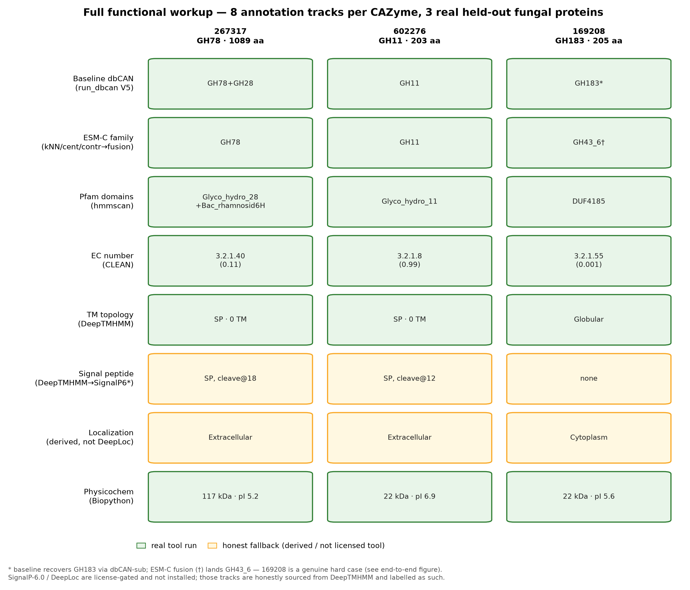

# Output contract

The pipeline publishes a **standardized, versioned layout** — one `manifest.json` plus a
funcscan-style tree. Downstream consumers (the BioForge ingester) read only this contract, never
a tool's raw output.

```
<outdir>/cazyme_advanced/
  manifest.json                      # the contract entry point
  predictions/<sample>/
    ESM-C-kNN.tsv  ESM-C-centroid.tsv  ESM-C-contrastive.tsv
    Foldseek-CAZyme3D.tsv  SaProt.tsv  fusion.tsv
  features/<sample>/
    domains.tsv  ec_prediction.tsv  deeptmhmm.tsv  signalp6.tsv
    localization.tsv  physicochem.tsv  structures.tsv
    structures/<protein_id>.pdb
```

Every prediction TSV shares the same normalized schema (`protein_id`, `family`, `confidence`,
`ec`, `all_families`, `extra`), and each `manifest.json` becomes one **versioned BioForge
release** loaded additively next to the baseline — so "advanced vs baseline" is a query across
releases, never a mutation.



---

The full specification (`nf/OUTPUT_CONTRACT.md`) is reproduced below.

--8<-- "nf/OUTPUT_CONTRACT.md"
