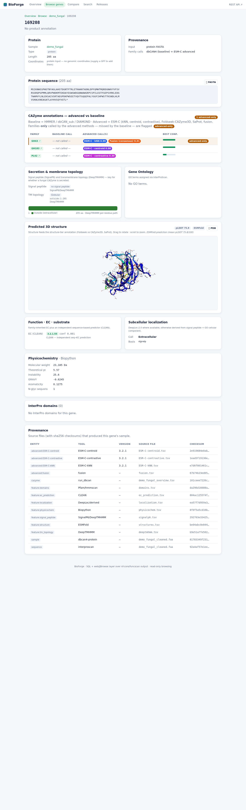

# The web UI

Passing `--serve` ingests the manifest into a versioned **BioForge** SQLite database and launches
a FastAPI/uvicorn web app. Each gene page is a genuine deep-dive — every card is populated from
real data.

!!! note "Viewing from your laptop"
    uvicorn binds `127.0.0.1` on the server. Forward the port:
    ```bash
    ssh -L 8000:127.0.0.1:8000 xinpeng@met.unl.edu     # then open http://localhost:8000
    ```

## Dashboard & browse


## Per-gene deep-dive

The hero protein **267317** — advanced-vs-baseline family calls, a per-residue DeepTMHMM topology
track, the ESMFold model in an interactive **3Dmol** viewer coloured by pLDDT, plus EC /
localization / physicochemistry / Pfam-domain / GO cards:


The gray-zone case **169208** (baseline missed it; the advanced tier flags it):



!!! info "True-browser captures"
    These screenshots are produced by `capture_ui.sh` — headless Chrome against the live server,
    so they render real CSS + JavaScript + the 3Dmol WebGL viewer, not a static mock.
