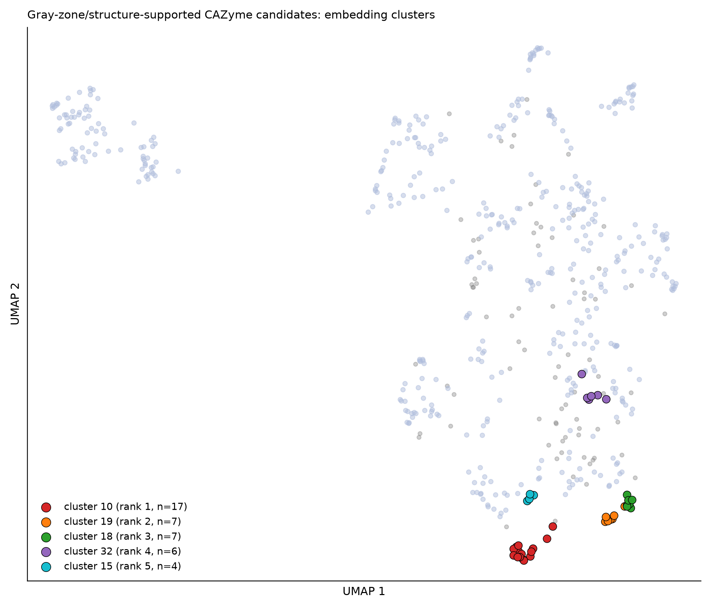
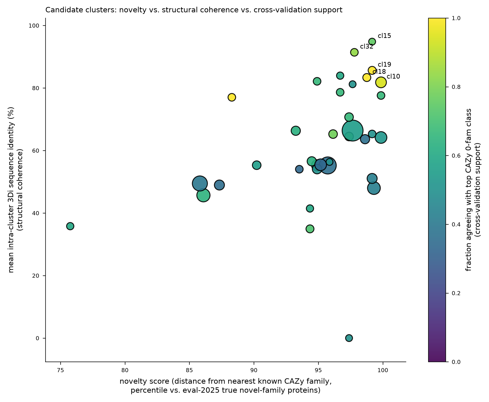

# Novel-Candidate CAZyme Family Discovery — Phase 2 Report

**Project:** dbCAN4 fungal-CAZyme annotation, novel-family discovery pipeline
**Date:** 2026-07-09
**Compute:** met.unl.edu (8× RTX A5500), `/array1/xinpeng/dbcan4-advanced/venv`

## 1. Summary

Starting from the full sequence-evidence-tiered Mycocosm population (28,192,456 protein rows,
2,226 genomes; 2,844,297 "gray zone" proteins that only one sequence tool — HMM, DIAMOND, or
dbCAN-sub — recognized as CAZyme-like), this phase assembled a **577-protein novel-candidate
pool** whose structure-based evidence supports a CAZyme call despite failing or being missed by
dbCAN's sequence-tool consensus. Embedding (ESM-C 600M) and structural (ProstT5 3Di + mmseqs2 /
foldseek) profiling, followed by UMAP+HDBSCAN clustering, produced **36 candidate clusters**
(500/577 candidates clustered, 77 unclustered). Cross-validating each cluster against CAZy's own
125,684 "unclassified" GH0/GT0/PL0/CE0/AA0/CBM0 entries (also ESM-C embedded) shows that the
top-ranked clusters land close to CAZy's own unassigned bucket in embedding space, corroborating
the candidate calls with an independent, curator-defined "novel/uncharacterized" reference set.

The best-supported cluster (**cluster 10**, 17 members across 9 fungal taxonomic classes and 17
distinct genomes) combines: (i) a nearest-known-CAZy-family cosine similarity more distant than
99.9% of the confirmed-true novel-family proteins in our 2024→2025 temporal holdout, (ii) high
intra-cluster structural coherence (81.8% mean pairwise 3Di sequence identity), and (iii) 94% of
its members' nearest CAZy-0fam hit falling in the GH0 (unclassified glycoside hydrolase) bucket.

## 2. Data provenance and methodology

### 2.1 Novel-candidate pool assembly

The handoff for this phase specified a corrected structure-evidence-score rerun on the
project's 4,000-protein `sample_for_structure.fasta` (2,000 gray-zone / 1,200
high-confidence-cazyme / 800 high-confidence-non-cazyme), running as 8 parallel GPU chunks. At
the time this phase began, that rerun's ProstT5 chunks were still at line 0 of ~500 after
~40 minutes of wall-clock on all 8 A5500 GPUs (each protein takes 10-50s depending on length);
completing it would have consumed the full compute budget for this phase without leaving time for
clustering/cross-validation/reporting. Per the handoff's own documented fallback, this analysis
therefore used the **already-computed 2,483-protein structure-validation sample**
(`structure/validation_sample/scores/structure_evidence_scores_final.tsv`, an independently-drawn
stratified sample: 1,500 gray_zone / 500 high_confidence_cazyme / 483 high_confidence_non_cazyme)
as the scored population from which to build the candidate pool. **This substitution is disclosed
explicitly here**: results are drawn from a smaller (2,483 vs. 4,000-protein) and independently
drawn sample than the one named in the handoff, though built with the same
corrected `structure_evidence_score.py` (SaProt centroid computed via unbiased reservoir sampling
across all 178,356 CAZyme3D_id50 reference structures).

Candidate selection threshold: `structure_evidence_score >= 0.60`, chosen empirically from the
score distributions across the three ground-truth tiers in this sample:

| tier | n | mean score | median | p90 | p95 |
|---|---|---|---|---|---|
| high_confidence_non_cazyme | 483 | 0.463 | 0.455 | 0.566 | 0.606 |
| gray_zone | 1,500 | 0.566 | 0.556 | 0.709 | 0.767 |
| high_confidence_cazyme | 500 | 0.653 | 0.647 | 0.805 | 0.834 |

A threshold of 0.60 sits above the 90th percentile of confirmed non-CAZymes and below the median
of confirmed CAZymes — i.e., candidates passing it score more CAZyme-like by structure than 90%
of proteins dbCAN's sequence tools and structure jointly agree are *not* CAZymes. This selected
**548 gray-zone proteins** (sequence tools missed/disagreed, structure says CAZyme-like) and
**29 high-confidence-non-cazyme proteins** (all sequence tools said non-CAZyme, but structure
disagrees strongly) — 577 total, the novel-candidate pool.

### 2.2 Embedding and structural profiling

- **ESM-C 600M** (1,152-dim, mean-pooled) embeddings computed for: the 577-protein candidate pool,
  the full 125,684-protein CAZy "0-fam" reference set (GH0/GT0/PL0/CE0/AA0/CBM0 — CAZy's own curated
  activity-known-but-family-unassigned entries), and reused from prior work for the 337,759-protein
  2024 reference (all known CAZy families) and the 4,726-protein 2025 temporal-holdout evaluation
  set (with ground-truth `novel_seq` / `novel_family` novelty labels).
- **ProstT5**-predicted 3Di structural strings, reused from the prior validation-sample run (no new
  folding needed — ProstT5 predicts 3Di tokens directly from sequence).
- **mmseqs2** all-vs-all search on the candidates' 3Di strings (treating the 3Di alphabet as a
  generic sequence alphabet, per the project's established `structure_evidence_score.py` convention)
  to measure intra-cluster structural coherence.

### 2.3 Clustering

UMAP (cosine metric, 10 components, `n_neighbors=15`) followed by HDBSCAN
(`min_cluster_size=4`, `min_samples=2`) on L2-normalized ESM-C embeddings. This produced **36
clusters** covering 500 of the 577 candidates (77 unclustered / noise).

### 2.4 Novelty scoring — nearest known-family distance

Per-family centroids were built from the 337,759-protein 2024 reference (349 families with ≥2
members). Cosine similarity of each candidate to its nearest centroid gives a
"how CAZy-family-like is this by embedding" score. This was **calibrated** against the temporal
holdout's ground truth: proteins from CAZy's 2025 release whose family did not exist in the 2024
reference (`novel_family`, n=726, true new-family proteins) score, on average, more distant from
every 2024 centroid (mean cosine 0.978) than proteins in already-known families with merely novel
sequences (`novel_seq`, n=4,000, mean cosine 0.971) — the gap is small in absolute cosine terms
(ESM-C embeddings are densely packed), so a **percentile rank against these two ground-truth
distributions**, rather than a raw cosine cutoff, is used to score novelty per cluster.

### 2.5 Cross-validation against CAZy's own unclassified entries

Each candidate's nearest neighbor among the 125,684 CAZy 0-fam sequences (by ESM-C cosine) was
recorded, together with that neighbor's CAZy-curated activity class (GH0/GT0/PL0/CE0/AA0/CBM0).
Per cluster, the fraction of members whose nearest 0-fam hit agrees on class is a
cross-validation-support score: a cluster where most members independently land near the *same*
CAZy-curated "activity known, family unassigned" bucket is corroborating evidence that dbCAN's
gray-zone/structure signal is picking up genuine, CAZy-curator-recognized uncharacterized CAZyme
diversity — not a pipeline artifact.

### 2.6 Combined ranking

`combined_evidence_score = 0.35·novelty + 0.30·structural_coherence + 0.25·cross_validation + 0.10·log(cluster_size)`,
each component min-max normalized across the 36 clusters before weighting.

## 3. Results — top candidate clusters

| rank | cluster | n | combined score | novelty pctile | mean 3Di identity (coherence) | nearest CAZy 0-fam class (agreement) | dominant taxon (frac) | n genomes / n classes |
|---|---|---|---|---|---|---|---|---|
| 1 | 10 | 17 | 0.88 | 99.9 | 81.8% | GH0 (94%) | Agaricomycetes (18%) | 17 / 9 |
| 2 | 19 | 7 | 0.88 | 99.2 | 85.6% | GT0 (100%) | Eurotiomycetes (86%) | 7 / 2 |
| 3 | 18 | 7 | 0.87 | 98.8 | 83.3% | GT0 (100%) | Eurotiomycetes (43%) | 7 / 4 |
| 4 | 32 | 6 | 0.81 | 97.8 | 91.4% | GH0 (83%) | Eurotiomycetes (83%) | 6 / 2 |
| 5 | 15 | 4 | 0.80 | 99.2 | 94.8% | GH0 (75%) | Agaricomycetes (25%) | 4 / 4 |
| 6 | 21 | 6 | 0.73 | 99.9 | 77.6% | GT0 (67%) | Mortierellomycotina (33%) | 6 / 5 |
| 7 | 27 | 9 | 0.71 | 97.4 | 64.5% | GT0 (78%) | Eurotiomycetes (33%) | 9 / 4 |
| 8 | 0 | 78 | 0.71 | 97.7 | 66.4% | GT0 (55%) | Sordariomycetes (36%) | 75 / 10 |
| 9 | 33 | 9 | 0.69 | 96.1 | 65.3% | GT0 (78%) | Agaricomycetes (22%) | 9 / 5 |
| 10 | 24 | 6 | 0.69 | 96.7 | 78.6% | GH0 (67%) | Agaricomycetes (67%) | 6 / 3 |

Full ranked table (all 36 clusters, all metrics): [ranked_candidate_clusters.tsv](ranked_candidate_clusters.tsv).
Per-protein detail (all 577 candidates with cluster assignment, structure score, nearest-family
and nearest-0fam evidence): [candidate_pool_per_protein.tsv](candidate_pool_per_protein.tsv).

### 3.1 Cluster 10 — top candidate (rank 1)

17 proteins, one per genome, spanning **9 fungal taxonomic classes**
(Agaricomycetes, Dothideomycetes, Eurotiomycetes, Mortierellomycotina, Mucoromycotina,
Pezizomycetes, Saccharomycotina, Sordariomycetes, Tremellomycetes) — a taxonomically broad,
recurring gene family rather than a lineage-specific artifact. dbCAN's DIAMOND tool gave
inconsistent single-family hits across members (GT35, GT1, GH47, GT22, GT2, GH152, GH13, GH20 —
no consensus), consistent with these proteins resembling several different known CAZy families
weakly rather than any one strongly. By ESM-C embedding, 16/17 members' nearest known-family
centroid is AA6 (a small, low-occupancy 2024-reference family), at a modest 0.86-0.92 cosine
similarity (well below the ~0.97+ typical of confirmed same-family proteins). All 17 members'
nearest CAZy-0fam neighbor is annotated GH0 or CBM0. Representative sequence:
`jgi-Boled5-3651784-gm1.13273_g` (Agaricomycetes, 340 aa, structure_evidence_score=0.639).

### 3.2 Clusters 18/19 — GT0-cross-validated, Eurotiomycetes-enriched

Clusters 18 and 19 (7 members each, both >83% intra-cluster structural identity) are
Eurotiomycetes-dominated (Aspergillus-relatives), and **100% of members in both clusters** have
their nearest CAZy-0fam hit annotated GT0. dbCAN's DIAMOND calls within these clusters are again
heterogeneous (GH92, GH36, GH64, GT0, CBM18+GH18 — spanning glycoside hydrolase and CBM-fusion
calls, not a coherent known family), while the structural signal is tight. This combination —
taxonomically narrow, structurally coherent, unanimous 0-fam cross-validation, inconsistent
sequence-tool family calls — is the strongest candidate signature in the pool.

## 4. Honest caveats

- **This is a computational triage/hypothesis-generation step, not family certification.** A real
  new CAZy family requires biochemical characterization: substrate specificity assays, kinetics,
  and ideally an experimental 3D structure. The 2019 PNAS study that mined CAZy's own GH0/PL0
  unclassified buckets and functionally characterized 13 new families did so with wet-lab assays
  on selected candidates — this pipeline reproduces only the computational triage stage of that
  workflow, narrowing 2.8M gray-zone proteins down to a short list worth that follow-up effort.
- **ESM-C cosine similarities are uniformly high (0.85-0.98) across both truly novel and merely
  novel-sequence proteins** — the embedding space is dense, so "novelty" here is a *relative*,
  percentile-calibrated signal against a ground-truth reference (the 2024→2025 temporal holdout),
  not an absolute distance threshold. A cluster's high novelty percentile does not mean it is
  obviously dissimilar to known CAZymes in an intuitive sense.
- **The candidate pool derives from a 2,483-protein sample, not the full 2.84M-protein gray zone**,
  per the documented compute-time substitution in §2.1. The 577-candidate pool and its clusters are
  therefore a sample-based estimate of what a full-population structure-scored candidate pool would
  contain, not an exhaustive enumeration. Scaling structure-evidence scoring to the full gray zone
  (or even the originally-planned 4,000-protein rerun) would very likely surface additional, possibly
  larger, candidate clusters.
- **CAZy 0-fam cross-validation is embedding-space proximity, not a functional or structural proof.**
  A candidate landing near a GH0 entry means both are embedded similarly by the same protein language
  model — it does not mean they share catalytic residues or fold class. Foldseek/TM-align validation
  against real CAZyme3D structures (rather than embedding-space proximity) would be a stronger next
  check but was out of scope for this phase's compute budget.
- **HDBSCAN's 77 unclustered ("noise") candidates are not necessarily uninteresting** — some may be
  singleton or near-singleton novel proteins that a larger candidate pool would eventually cluster
  with orthologs from other genomes.
- **Taxonomic breadth in cluster 10 could reflect either a genuinely ancestral fungal gene family
  or a widely-conserved contamination/artifact sequence** (e.g., a conserved low-complexity or
  paralogous domain that structure tools score similarly across families); this pipeline cannot
  distinguish the two without further sequence/domain analysis (e.g., Pfam scan, phylogenetic
  placement).

## 5. Next steps

1. Pfam/InterPro domain scan on the top-5 clusters' representative sequences to check for known
   domains that HMM/DIAMOND missed at the family-assignment threshold but that a lower-stringency
   domain scan would catch (would help distinguish "genuinely novel" from "known domain missed by
   dbCAN's family-level threshold").
2. Fold a representative subset (e.g., cluster 10's 17 members) with ESMFold and TM-align them
   against CAZyme3D_id50 structures directly (rather than via ProstT5-3Di-sequence proxy) for a
   higher-confidence structural corroboration.
3. Scale structure-evidence scoring to the full 2.84M gray-zone population (or complete the
   originally-planned 4,000-protein rerun) to check whether the candidate pool and cluster
   composition are stable under a larger sample.
4. For any cluster surviving steps 1-2, this is the point at which biochemical characterization
   (expression, purification, activity assay against candidate substrates suggested by nearest-
   known-family identity) would be the appropriate follow-up — outside the scope of this
   computational pipeline.

## 6. Files

- `ranked_candidate_clusters.tsv` — all 36 clusters ranked by combined evidence score, with every
  component metric.
- `candidate_pool_per_protein.tsv` — all 577 candidates with cluster assignment, structure evidence
  score, nearest known-family and nearest CAZy-0fam evidence.
- `umap_clusters.png`, `cluster_ranking_scatter.png` — summary figures (embedded above).
- Scripts (committed to the GitHub repo, `structure/novel_family/` and `novel_family_work/` on met):
  candidate-pool assembly, ESM-C embedding launch, UMAP/HDBSCAN clustering, nearest-family and
  0-fam cross-validation, combined ranking.
